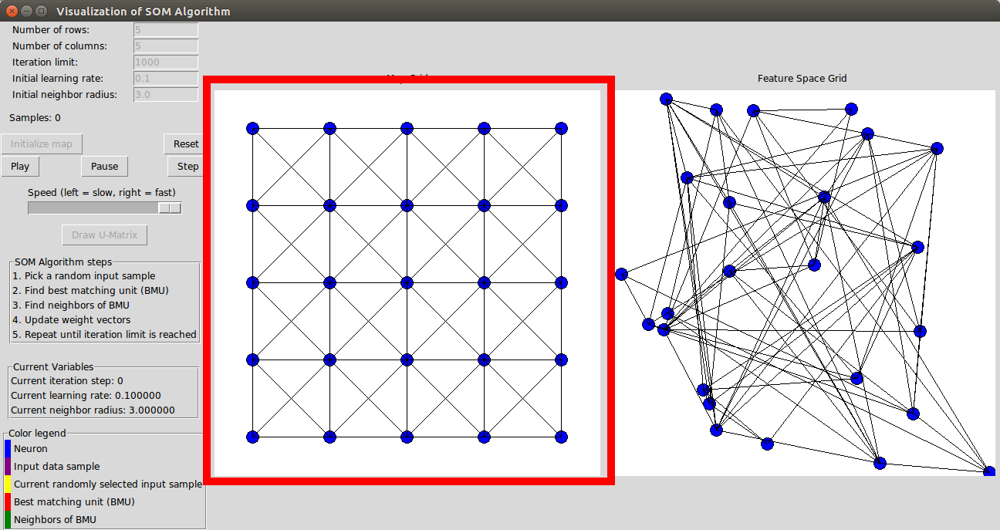
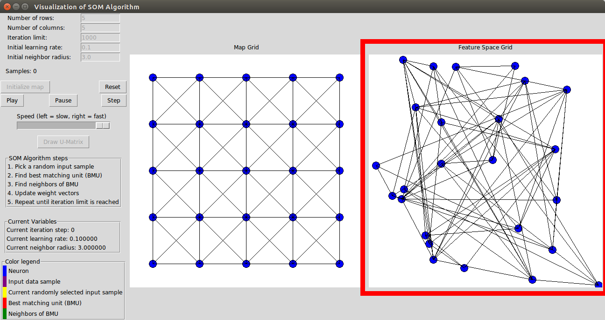
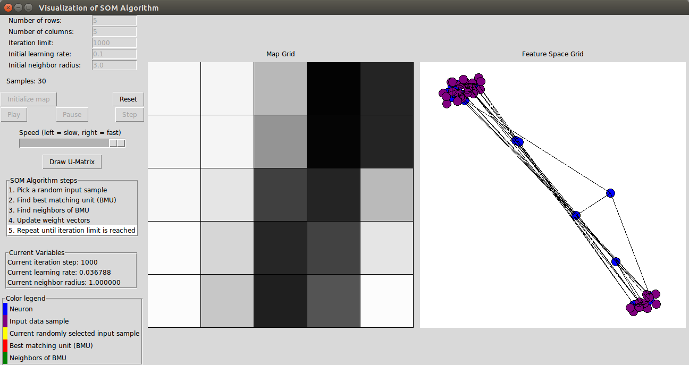
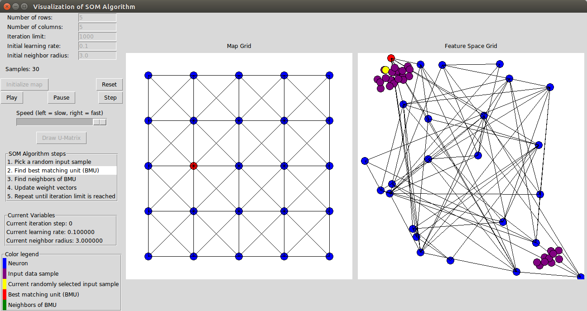
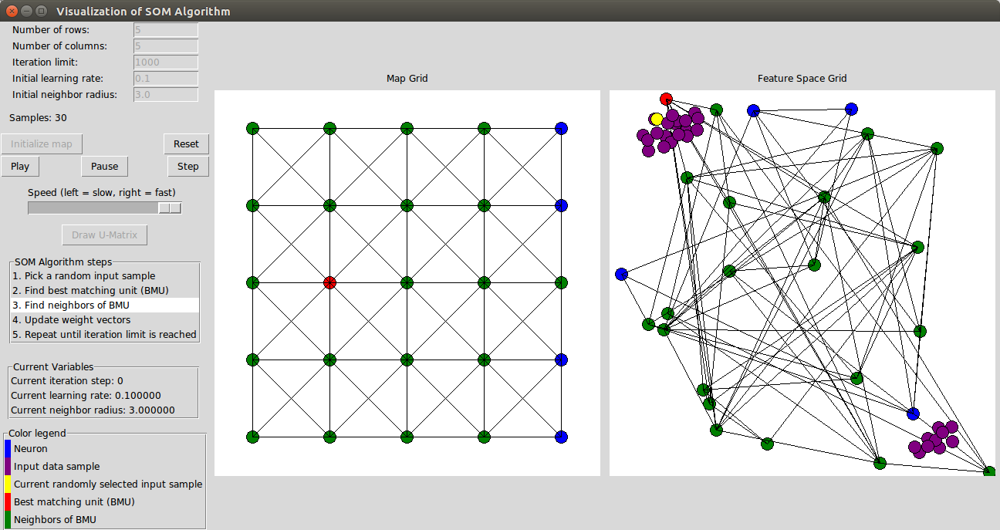
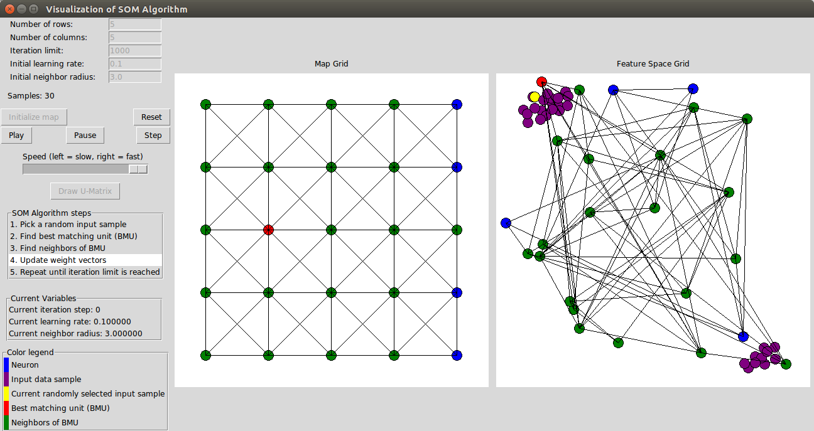

# SOM Visualization

A small visualization tool for Self-Organizing Maps (SOM).

This visualization is meant to be used for a better understanding of what a SOM is, how it is
built and how it works.
Moreover the tool can be used to gather a better understanding on how 
selected parameters influence its outcome.

## Usage

Clone or download the repository.
From the command line navigate to the folder and execute

`$ python som_visualization.py`.

The tool allows you to set the initial parameters for a SOM in the top left corner.
After you have initialized the map by pressing the button 'Initialize map'
you will see the neurons of the map on the left and their weight vectors in 
the feature space on the right canvas (for details see the next section).

You can draw (purple) input samples that will be used for the training of the SOM on
the right canvas by simply clicking on it. 
By clicking on the button 'Play' you can start the training.
With the speed slider you can adjust the speed of the training.
If you prefer to watch the individual algorithm steps in more details, you can
also make use of the button 'Step', which simply executes one algorithm step.
Note that if you already pressed 'Play' you have to press 'Pause' to be able to make use
of the 'Step' button.

Note: The implementation of the SOM and its neurons is not mean to be the most
efficient one. Instead the implementation, which can be found in the directory 'source'
can be seen as an easy to read example on how a SOM is built and works internally.

## On Self-Organizing Maps

A Self-Organizing Map (SOM) is a type of an Artificial Neural Network [1, S.1].
It is trained using unsupervised learning and generally applied to get insights
into topological properties of input data, e.g. for determining clusters.
The input data is normally taken from a high-dimensional feature space.
After trainig a SOM on the input data, it can can be used to visualize 
the high-dimensional input data in a (typically) two- or three-dimensional view, 
preserving its topological properties [1, S.12].

A SOM consists of only one layer of neurons [1, S.3].
It is this lattice of neurons that is generally called the 'map'.
Each neuron knows its position in the map and has its own weight vector.
In the two-dimensional case, 
the position of the neuron is described by an (x,y)-coordinate.
The coordinate of a neuron never changes.
Hence the map itself is a fixed structure, that does not change [1, S.4].

### Visualization of the neurons within the map

The map can be seen on the left canvas of the visualization:

Each blue circle on the canvas represents one neuron in the map.
To better visualize the map, connections from one neuron to all its direct 
neighbors are drawn by black lines.

### Visualization of the neurons within the feature space

There is another way to think about the positioning of the neurons.
In the above case, each neuron was drawn according to its position in the map.
But what about the weight vectors?
The weight vectors represent the position of the 
neurons in the feature space [1, S.3].
Because the weight vectors represent the position of the neurons in the feature space,
they have the same dimensionality as the input data.
Note, that although normally the feature space is high-dimensional,
for visualization purposes only a two-dimensional feature space was chosen here.
In this implementation, the weight vectors are initialized with random values, 
but other strategies for initialization exist as well [1, S.4].

The representation of the neurons in the feature space can be seen on the right canvas
of the visualization:

Neurons that are neighbors in the map (left canvas) are still connected by
black lines.

Now a total number of 30 samples (purple circles) is chosen for training.
The samples are clearly split into two clusters:

During training, the weight vectors change in such a way, that the
distribution and topology of the input data is represented [2, S.3].
After training the neurons (via their weight vectors) represent 
the samples from the input data. 
A neuron 'represents' an input sample simply means, that its weight vector
is the closest to the input sample in the feature space.
Similar (hence close) input samples are represented by neighboring neurons:

Remember, that normally the feature space is high-dimensional and hence can not
be visualized very well.
As the map grid itself does not reveal the distribution of the weight vectors
in the feature space, the result of the training is often visualized with a
Unified Distance Matrix (U-matrix).
In a U-matrix, the distances between neighboring neurons are visualized:

Here a gray-scale was used. White cells mean, that the average distance to
the neighbors of this neurons is low. Black cells mean, that the average distance
to the neighbors of this neurons is high.
In the U-matrix above you can clearly see, that there are two clusters.
One cluster is represented by the neurons in the left part of the map,
the other cluster is represented by the neurons in the right part of the map.
In each cluster the neurons are relatively close to each other (white or light gray cells).
The neurons whose weight vectors lie between the to clusters can be seen as black
cells in the middle of the map.
They have a relatively high average distance to all their neighbors.

### Training Algorithm

Before initializing the map, the following fixed parameters must be chosen:
Shape of the map and number of neurons, iteration limit, initial learning rate
and initial neighbor radius.

During training the following happens in each iteration [2, S.5-7]:

1. Pick a random input sample (yellow).

2. Find the neuron, whose weight vector is closest to the selected input sample
in the feature space. Here, the distance is calculated with the euclidean distance.
The neuron is called the 'best matching unit' (BMU).

3. Find the neighbors of the BMU, determined by the neighbor radius, which is
calculated newly in each step. See below for details on the calculation.

4. Update the weight vectors of the BMU and its neighbors in such a way, that 
they move closer to the selected input sample.
The current learning rate determines how much each of them moves towards the input sample.
See below for details on the calculation.

5. Repeat until the iteration limit is reached.

#### Calculation of parameters

The following equations are used for the calculation of the learning rate and
neighborhood radius in this implementation of the SOM.
They are influenced by the references listed below.

##### Neighborhood radius

constant_radius_decay = iteration_limit / log(init_learning_rate)

decay = e^(-current_iteration_step / constant_radius_decay)

current_neighborhood_radius = init_neighborhoor_radius * decay 

##### Learning rate

decay = e^(-current_iteration_step / iteration_limit)

current_learning_rate = init_learning_rate * decay

##### Update value of weight vector

distance = euclidean_distance(neuron_position_in_map, bmu_position_in_map)

influence = e^(-distance / (2 * current_neighborhood_radius))

delta = selected_input_sample - weight_vector

update_value = current_learning_rate * delta * influence

new_weight_vector = weight_vector + update_value

### General remarks

There exist different options in realizing SOMs. Moreover they all have
some kind of drawbacks. See [1, S.10-12] for a good overview.
Generally, as always, the setting of the different parameters of the SOM
may heavily influence its output, quality and performance. 
This small command line tool here, although limited to a two-dimensional feature space,
may be used to get a feeling on how different settings affect the training of the SOM.

### References

[1] Astudillo, César and John Oommen, B. (2014). Topology-oriented self-organizing maps: 
A survey. Pattern Analysis and Applications. 17. 10.1007/s10044-014-0367-9.

[2] http://www.shy.am/wp-content/uploads/2009/01/kohonen-self-organizing-maps-shyam-guthikonda.pdf, last visited 07.07.2018

[3] https://en.wikipedia.org/wiki/Self-organizing_map#Variables, last visited 07.07.2018

[4] http://www.comp.hkbu.edu.hk/~markus/teaching/comp7650/SOM.pdf, last visited 07.07.2018

[5] http://www.cs.bham.ac.uk/~jxb/NN/l16.pdf, last visited 07.07.2018
